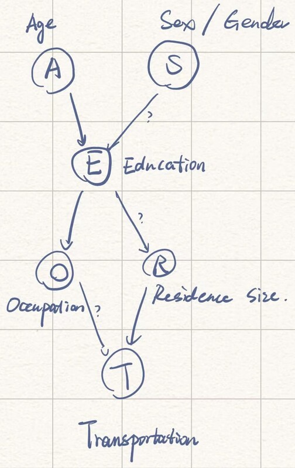

# Project 1

## Exercise 1

### a

| Node | Parent(s)   | Child(ren)  |
| ---- | ----------- | ----------- |
| A    | $\emptyset$ | E           |
| S    | $\emptyset$ | E           |
| E    | A,S         | O,R         |
| O    | E           | T           |
| R    | E           | T           |
| T    | O,R         | $\emptyset$ |

### b

Global distribution:

$$
P(A,S,E,O,R,T)
$$

$$
P_G=(3^2\times 2^4)-1=143
$$

Local distribution:

$$
\begin{align*}
P_L=&(3-1)+(2-1)+(2-1)(3\times 2)+(2-1)\cdot 2\\
&+(2-1)\cdot 2+(3-1)(2\times 2)\\
=&21
\end{align*}
$$

### c, d, e

See `Project_1_ex1.R`.

### f

1. $(A\perp S)$, $(S\perp A)$
2. $(O\perp R, A, S | E)$
3. $(R\perp O, A, S | E)$
4. $(T\perp A, S, E | O, R)$

$$
\begin{align*}
P(A,S,E,O,R,T)=
&P(A)\cdot P(E)\cdot P(E|A,S) \cdot P(O|E)\cdot\\
&P(R|E)\cdot P(T|O,R)
\end{align*}
$$

## Exercise 2

See `Project_1_ex2.R`.