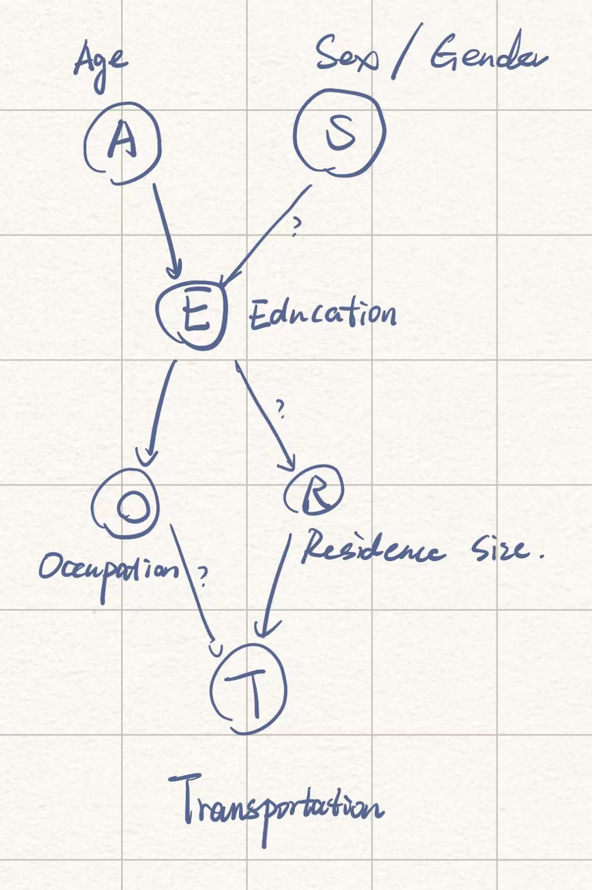

## Exercise 1

### a



| Node | Parent(s)   | Child(ren)  |
| ---- | ----------- | ----------- |
| A    | $\emptyset$ | E           |
| S    | $\emptyset$ | E           |
| E    | A,S         | O,R         |
| O    | E           | T           |
| R    | E           | T           |
| T    | O,R         | $\emptyset$ |

### b

Global distribution:

$$
P(A,S,E,O,R,T)
$$

$$
P_G=(3^2\times 2^4)-1=143
$$

Local distribution:

$$
\begin{align*}
P_L=&(3-1)+(2-1)+(2-1)(3\times 2)+(2-1)\cdot 2\\
&+(2-1)\cdot 2+(3-1)(2\times 2)\\
=&21
\end{align*}
$$

### c

```{r}
# import package
library(readxl)

# read data
survey <- read_excel("./survey.xlsx")
```

### d

#### Variables

```{r}
age <- factor(survey$A, levels = c("young", "adult", "old"))
sex <- factor(survey$S, levels = c("M", "F"))
education <- factor(survey$E, levels = c("high", "uni"))
occupation <- factor(survey$O, levels = c("emp", "self"))
residence <- factor(survey$R, levels = c("small", "big"))
transportation <- factor(survey$T, levels = c("car", "train", "other"))
```

#### CPTs

```{r}
# A, P(A)
p_adult <- length(which(age == "adult")) / length(age)
p_young <- length(which(age == "young")) / length(age)
p_old <- length(which(age == "old")) / length(age)
cpt_a <- c(p_young, p_adult, p_old)
names(cpt_a) <- c("young", "adult", "old")
print(cpt_a)
```

```{r}
# S, P(S)
p_m <- length(which(sex == "M")) / length(sex)
p_f <- length(which(sex == "F")) / length(sex)
cpt_s <- c(p_m, p_f)
names(cpt_s) <- c("M", "F")
print(cpt_s)
```

```{r}
# E, P(E | A, S)

e_get_p <- function(a, s, e) {
  return(length(which(survey$A == a & survey$S == s & survey$E == e)) /
           length(which(survey$A == a & survey$S == s)))
}

p_high_adult_m <- e_get_p("adult", "M", "high")
p_uni_adult_m <- 1 - p_high_adult_m
p_high_adult_f <- e_get_p("adult", "F", "high")
p_uni_adult_f <- 1 - p_high_adult_f
p_high_young_m <- e_get_p("young", "M", "high")
p_uni_young_m <- 1 - p_high_young_m
p_high_young_f <- e_get_p("young", "F", "high")
p_uni_young_f <- 1 - p_high_young_f
p_high_old_m <- e_get_p("old", "M", "high")
p_uni_old_m <- 1 - p_high_old_m
p_high_old_f <- e_get_p("old", "F", "high")
p_uni_old_f <- 1 - p_high_old_f

cpt_e <- matrix(c(p_high_adult_m, p_uni_adult_m,
                  p_high_adult_f, p_uni_adult_f,
                  p_high_young_m, p_uni_young_m,
                  p_high_young_f, p_uni_young_f,
                  p_high_old_m, p_uni_old_m,
                  p_high_old_f, p_uni_old_f), nrow = 6, ncol = 2, byrow = TRUE)

colnames(cpt_e) <- c("high", "uni")
rownames(cpt_e) <- c("adult_M", "adult_F", "young_M", "young_F",
                     "old_M", "old_F")
print(cpt_e)
```

```{r}
# O, P(O | A, S)

o_get_p <- function(e, o) {
  return(length(which(survey$E == e & survey$O == o)) /
           length(which(survey$E == e)))
}

p_emp_high <- o_get_p("high", "emp")
p_self_high <- 1 - p_emp_high
p_emp_uni <- o_get_p("uni", "emp")
p_self_uni <- 1 - p_emp_uni

cpt_o <- matrix(c(p_emp_high, p_self_high,
                  p_emp_uni, p_self_uni), nrow = 2, ncol = 2, byrow = TRUE)
colnames(cpt_o) <- c("emp", "self")
rownames(cpt_o) <- c("high", "uni")
print(cpt_o)
```

```{r}
# R, P(R | A, S)

r_get_p <- function(e, r) {
  return(length(which(survey$E == e & survey$R == r)) /
           length(which(survey$E == e)))
}

p_small_high <- r_get_p("high", "small")
p_big_high <- 1 - p_small_high
p_small_uni <- r_get_p("uni", "small")
p_big_uni <- 1 - p_small_uni

cpt_r <- matrix(c(p_small_high, p_big_high,
                  p_small_uni, p_big_uni), nrow = 2, ncol = 2, byrow = TRUE)
colnames(cpt_r) <- c("small", "big")
rownames(cpt_r) <- c("high", "uni")
print(cpt_r)
```

```{r}
# T, P(T | R)

t_get_p <- function(o, r, t) {
  return(length(which(survey$O == o & survey$R == r & survey$T == t)) /
           length(which(survey$O == o & survey$R == r)))
}

p_car_emp_small <- t_get_p("emp", "small", "car")
p_train_emp_small <- t_get_p("emp", "small", "train")
p_other_emp_small <- 1 - p_car_emp_small - p_train_emp_small
p_car_emp_big <- t_get_p("emp", "big", "car")
p_train_emp_big <- t_get_p("emp", "big", "train")
p_other_emp_big <- 1 - p_car_emp_big - p_train_emp_big
p_car_self_small <- t_get_p("self", "small", "car")
p_train_self_small <- t_get_p("self", "small", "train")
p_other_self_small <- 1 - p_car_self_small - p_train_self_small
p_car_self_big <- t_get_p("self", "big", "car")
p_train_self_big <- t_get_p("self", "big", "train")
p_other_self_big <- 1 - p_car_self_big - p_train_self_big

cpt_t <- matrix(c(p_car_emp_small, p_train_emp_small,p_other_emp_small,
                  p_car_emp_big, p_train_emp_big, p_other_emp_big,
                  p_car_self_small, p_train_self_small, p_other_self_small,
                  p_car_self_big, p_train_self_big, p_other_self_big),
                nrow = 4, ncol = 3, byrow = TRUE)
colnames(cpt_t) <- c("car", "train", "other")
rownames(cpt_t) <- c("emp_small", "emp_big", "self_small", "self_big")
print(cpt_t)
```

### e

```{r}
# find P(A = "young", S = "M", E = "uni", O = "self", R = "big", T = "car")
p1 <- cpt_a["young"] * cpt_s["M"] * cpt_e["young_F", "uni"] *
  cpt_o["uni", "self"] * cpt_r["uni", "big"] * cpt_t["self_big", "car"]

# find P(A = "old", S = "F", E = "high", O = "emp", R = "big", T = "other")
p2 <- cpt_a["old"] * cpt_s["F"] * cpt_e["old_F", "high"] *
  cpt_o["high", "emp"] * cpt_r["uni", "big"] * cpt_t["emp_big", "other"]

# find P(A = "adult", S = "M", E = "uni", O = "self", R = "small", T = "train")
p3 <- cpt_a["adult"] * cpt_s["M"] * cpt_e["adult_M", "uni"] *
  cpt_o["uni", "self"] * cpt_r["high", "small"] * cpt_t["self_small", "train"]

print(p1)
print(p2)
print(p3)
```

### f

1. $(A\perp S)$, $(S\perp A)$
2. $(O\perp R, A, S | E)$
3. $(R\perp O, A, S | E)$
4. $(T\perp A, S, E | O, R)$

$$
\begin{align*}
P(A,S,E,O,R,T)=
&P(A)\cdot P(E)\cdot P(E|A,S) \cdot P(O|E)\cdot\\
&P(R|E)\cdot P(T|O,R)
\end{align*}
$$

## Exercise 2

### a

```{r}
# Load the necessary libraries
library(bnlearn)

# Create DAG
dag <- empty.graph(nodes = c("A", "S", "E", "O", "R", "T"))
dag <- set.arc(dag, from = "A", to = "E")
dag <- set.arc(dag, from = "S", to = "E")
dag <- set.arc(dag, from = "E", to = "O")
dag <- set.arc(dag, from = "E", to = "R")
dag <- set.arc(dag, from = "O", to = "T")
dag <- set.arc(dag, from = "R", to = "T")
print(dag)
```

`model` in the output is same as the local denpendencies that I have calculated in Exercise 1. So the created DAG should be correct.

### b

```{r}
# dag <- set.arc(dag, from = "R", to = "S")
```

An error occured. The error message shows *the resulting graph contains cycles*.

```{r}
# ? "misc utilities"
```

```{r}
# Obtain nodes of the DAG
print(nodes(dag))

# Obtain arcs of the DAG
print(arcs(dag))

# Obtain parents of the node "E"
print(parents(dag, node = "E"))

# Obtain children of the node "E"
print(children(dag, node = "E"))
```

```{r}
modelstring(dag)
```

According to the output, the results obtained are identical to those
of Exercise 1.

### c

```{r}
otherDag <- empty.graph(nodes = c("A", "S", "E", "O", "R", "T"))

arcs <- matrix(c("A", "E",
                 "S", "E",
                 "E", "O",
                 "E", "R",
                 "O", "T",
                 "R", "T"), ncol = 2, byrow = TRUE)

arcs(otherDag) <- arcs

print(otherDag)
```

```{r}
all.equal(dag, otherDag)
```

### d

```{r}
lastDag = model2network("[A][S][E|A:S][O|E][R|E][T|O:R]")

all.equal(dag, lastDag)
```

## Exercise 3

### a

```{r}
cpta <- array(c(0.320, 0.472, 0.208), dim = 3, dimnames = list(A = levels(age)))
print(cpta)
```

```{r}
cptS <- array(c(0.598, 0.402), dim = 2, dimnames = list(S = levels(sex)))
print(cptS)
```

```{r}
cpte <- array(c(0.8105263, 0.1894737,
                0.7194245, 0.2805755,
                0.8923077, 0.1076923,
                0.5384615, 0.4615385,
                0.6391753, 0.3608247,
                0.8461538, 0.1538462),
              dim = c(2, 3, 2), dimnames = list(E = levels(education),
                                                A = levels(age),
                                                S = levels(sex)))
print(cpte)
```

```{r}
cpto <- array(c(0.9808219, 0.01917808,
                0.9259259, 0.07407407),
              dim = c(2, 2), dimnames = list(O = levels(occupation),
                                             E = levels(education)))
print(cpto)
```

```{r}
cptr <- array(c(0.2821918, 0.7178082,
                0.1333333, 0.8666667),
              dim = c(2, 2), dimnames = list(R = levels(residence),
                                             E = levels(education)))
print(cptr)
```

```{r}
cptt <- array(c(0.5470085, 0.3760684, 0.07692308,
                0.7500000, 0.0000000, 0.25000000,
                0.5846995, 0.2158470, 0.19945355,
                0.6923077, 0.1538462, 0.15384615),
              dim = c(3, 2, 2), dimnames = list(T = levels(transportation),
                                                O = levels(occupation),
                                                R = levels(residence)))
print(cptt)
```

```{r}
cpts <- list(A = cpta, S = cptS, E = cpte, O = cpto, R = cptr, T = cptt)
print(cpts)
```

### b

```{r}
bn <- custom.fit(dag, cpts)
print(bn)
```

Upon verification, it has been confirmed that the CPTs of the `bn` are identical to those presented in Exercise 1.

```{r}
# Check the number of parameters
print(nparams(bn))

# Check the number of arcs
print(narcs(bn))

# Check the number of nodes
print(nnodes(bn))
```

### c

```{r}
# otherBn <- bn.fit(dag, survey)
```

I got an error message: *variable A is not supported in bnlearn (type: character).*.

```{r}
df_survey <- as.data.frame(survey)

library(dplyr)
df_survey <- mutate_if(df_survey, is.character, as.factor)

otherBn <- bn.fit(dag, df_survey)

print(otherBn)
print(modelstring(otherBn))
```

## Exercise 4

### a

```{r}
library(Rgraphviz)

# 1
graphviz.plot(dag, layout = "fdp", shape = "circle",
              main = "DAG with layout = 'fdp' and shape = 'circle' ")

# 2
graphviz.plot(dag, layout = "dot", shape = "ellipse",
              main = "DAG with layout = 'dot' and shape = 'dot' ")

# 3
graphviz.plot(dag, layout = "circo", shape = "circle",
              main = "DAG with layout = 'circo' and shape = 'circle' ")

# 4
graphviz.plot(dag, layout = "neato", shape = "rectangle",
              main = "DAG with layout = 'neato' and shape = 'rectangle' ")

# 5
graphviz.plot(dag, layout = "twopi", shape = "ellipse",
              main = "DAG with layout = 'twopi' and shape = 'ellipse' ")
```

### b

```{r}
# 1
aes <- list(nodes = nodes(dag), col = "blueviolet")

graphviz.plot(dag, layout = "dot", shape = "ellipse", highlight = aes,
              main = "dag")

# 2
aes <- list(arcs = arcs(dag), col = "blueviolet")

graphviz.plot(dag, layout = "dot", shape = "ellipse", highlight = aes,
              main = "dag")
# 3
aes <- list(nodes = nodes(dag), col = "black", textCol = "blueviolet")

graphviz.plot(dag, layout = "dot", shape = "ellipse", highlight = aes,
              main = "dag")
```

### c

```{r}
plotDag <- graphviz.plot(dag)

# path A->E->R->T, color green, dashed line stroke of thickness 3
edgeRenderInfo(plotDag) <- list(col = c("A~E" = "green", "E~R" = "green",
                                        "R~T" = "green"),
                                lty = c("A~E" = "dashed", "E~R" = "dashed",
                                        "R~T" = "dashed"),
                                lwd = c("A~E" = 3, "E~R" = 3, "R~T" = 3))

renderGraph(plotDag)
```

```{r}
plotDag <- graphviz.plot(dag)

# path S->E->O->T, color red, continuous line stroke of thickness 2
edgeRenderInfo(plotDag) <- list(col = c("S~E" = "red", "E~O" = "red",
                                        "O~T" = "red"),
                                lwd = c("S~E" = 2, "E~O" = 2, "O~T" = 2))

renderGraph(plotDag)
```

```{r}
plotDag <- graphviz.plot(dag)

# for {A, S}, {E}, {O, R}, {T} assign different aesthetic
nodeRenderInfo(plotDag) <- list(fill = c("A" = "red", "S" = "red",
                                         "E" = "blue", "O" = "green",
                                         "R" = "green", "T" = "yellow"),
                                shape = c("A" = "ellipse", "S" = "ellipse",
                                         "E" = "ellipse", "O" = "ellipse",
                                         "R" = "ellipse", "T" = "ellipse"))

renderGraph(plotDag)
```

### d

```{r}
bn.fit.barchart(bn$A, main = "A", xlab = "P(A)", ylab = "")
```

```{r}
bn.fit.dotplot(bn$A, main = "CPT of Age (A)", xlab = "P(A)", ylab = "")
```

## Exercise 5

```{r}
nodes <- c("A", "S", "E", "O", "R", "T")

levels <- list(A = c("young", "adult", "old"),
               S = c("M", "F"),
               E = c("high school", "university"),
               O = c("employee", "self-employed"),
               R = c("small", "big"),
               T = c("car", "train", "other"))

arcs <- matrix(c("A", "E",
                 "S", "E",
                 "E", "O",
                 "E", "R",
                 "O", "T",
                 "R", "T"), byrow = TRUE, ncol = 2)

get_nparams <- function(nodes, levels, arcs) {
  nparams <- 0
  for (i in seq_along(nodes)) {
    node <- nodes[i]
    nlevels <- length(levels[[node]])
    parents <- arcs[arcs[, 2] == node, 1]
    prod <- 1
    for (j in seq_along(parents)) {
      parent <- parents[j]
      nlevels_parent <- length(levels[[parent]])
      prod <- prod * nlevels_parent
    }
    nparams <- nparams + (nlevels - 1) * prod
  }
  return(nparams)
}

print(paste("Parameters of the local distributions of the BN: ", 
            get_nparams(nodes, levels, arcs)))
```