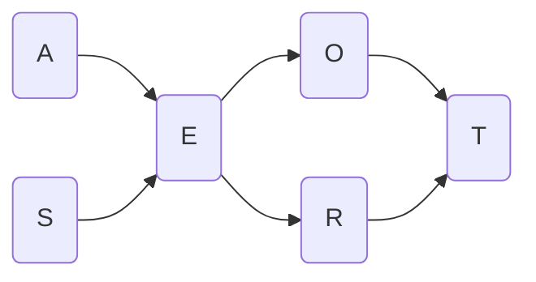

# PGW

## Project 1: Naive Bayesian Network

### Data

Columns of `survey.csv`:

- **Age** (A): **young** (if the person is younger than 30 years old), **adult** (between 30 and 60 years old) and **old** (over 60 years old).
- **Sex** (S): male **M** or female **F**.
- **Education** (E): **high school** (if the person completed at most secondary education) or **university** (if the person has university studies).
- **Occupation** (O): if the person is **employed** or **self-employed**.
- **Residence** (R): if the city where the person resides is **small** or **big**.
- **Transportation** (T): whether the person usually travels by **car**, **train** or **other** means.

#### Data Assumption

- No variable seems to affect the age and gender of respondents.
- Nowadays, being young seems to influence having a college education.
- Gender seems to influence which college major is chosen. For example, Computer Science has a higher percentage of men enrolled, while Early Childhood Education has a higher percentage of women enrolled.
- In general, a better education influences access to better jobs.
- The locality where a student lives seems to be influenced by the university where he/she studies (many students move close to their school).
- The job position might influence the mode of transportation used. For example, a remote place to work would require the use of a car, whereas if we work 2 blocks from our home, we could walk.
- The size of the city where one lives seems to influence the type of transportation used. For example, in large cities many people choose not to use the car, as the train/metro is a good alternative.

